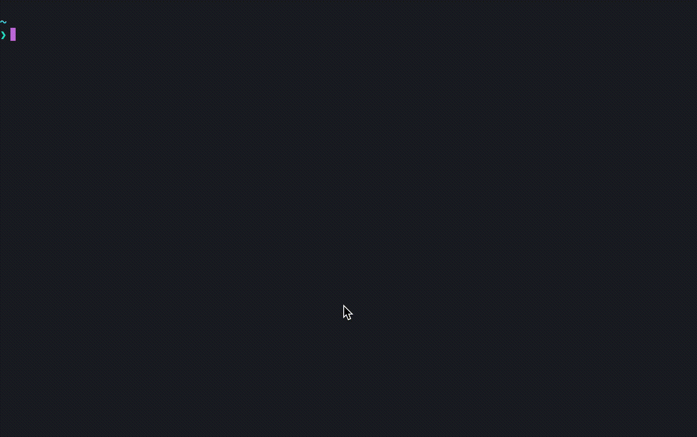

<p align="center">
  
</p>

## meta-crawler
url을 받아와 open graph 데이터와 섬네일과 파비콘은 로컬에 저장하고 로컬 url를 포함하는 data return 🚀

fish shell 기준

```shell
curl -v -L 'localhost:40000/?m_url='$URL
```

```env
# .env
PORT=8080 #도커 연결 포트8080 (local:40000 - 8080)
ORIGIN= #CORS관련 허용 도메인
FILE_SERVER_URI= #저장된 파일을 따른 url로 배포
DB= #mongodb
```